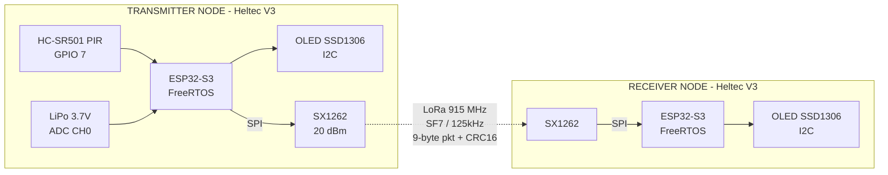
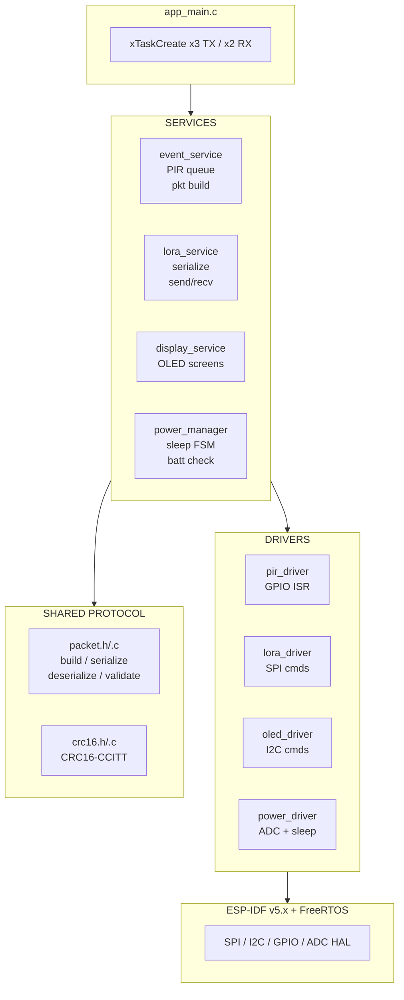

# LoRa IoT Node System

> ESP32-S3 IoT system for long-range event detection and wireless transmission using LoRa protocol.


---

## Overview

This project implements a complete IoT system using two **Heltec WiFi LoRa 32 V3** modules (ESP32-S3 + SX1262) communicating over LoRa at 915 MHz. A transmitter node detects motion events via a PIR sensor and sends structured packets to a receiver node, which validates data integrity and displays results on the integrated OLED screen.

Built entirely from scratch without external LoRa libraries — all SPI communication, packet protocol, and CRC16 validation are custom implementations.

---

## System Diagram



### Software Layer Diagram



---

## Hardware

| Component | Model | Notes |
|-----------|-------|-------|
| MCU | Heltec WiFi LoRa 32 V3 (ESP32-S3) | Both nodes |
| Radio | SX1262 | Integrated in module |
| Sensor | HC-SR501 PIR | Transmitter only |
| Display | OLED 0.96" SSD1306 | Integrated in module |
| Antenna | 915 MHz | Integrated in module |

### Transmitter GPIO Map

| Signal | GPIO | Type |
|--------|------|------|
| LoRa SCK | 9 | SPI |
| LoRa MOSI | 10 | SPI |
| LoRa MISO | 11 | SPI |
| LoRa CS | 8 | SPI |
| LoRa RST | 12 | GPIO |
| LoRa IRQ (DIO1) | 14 | GPIO |
| LoRa BUSY | 13 | GPIO |
| PIR Sensor | 7 | GPIO INPUT |
| Battery ADC | 1 | ADC |
| ADC Control | 37 | GPIO |
| Vext | 36 | GPIO |
| OLED SDA | 17 | I2C |
| OLED SCL | 18 | I2C |
| OLED RST | 21 | GPIO |

### Receiver GPIO Map

| Signal | GPIO | Type |
|--------|------|------|
| LoRa SCK | 9 | SPI |
| LoRa MOSI | 10 | SPI |
| LoRa MISO | 11 | SPI |
| LoRa CS | 8 | SPI |
| LoRa RST | 12 | GPIO |
| LoRa IRQ (DIO1) | 14 | GPIO |
| LoRa BUSY | 13 | GPIO |
| OLED SDA | 17 | I2C |
| OLED SCL | 18 | I2C |
| OLED RST | 21 | GPIO |

---

## Architecture
```
lora-iot-node/
├── transmitter/               # TX node - detects PIR events and transmits
│   ├── main/
│   │   └── app_main.c         # FreeRTOS tasks: event, lora_tx, power
│   └── components/
│       ├── drivers/
│       │   ├── lora_driver    # SPI communication with SX1262
│       │   ├── pir_driver     # GPIO interrupt service routine
│       │   └── power_driver   # ADC battery + light/deep sleep
│       └── services/
│           ├── event_service  # Event queue and packet building
│           ├── lora_service   # TX packet serialization
│           ├── power_manager  # Sleep state machine
│           └── display_service# OLED TX screen layouts
├── receiver/                  # RX node - receives, validates and displays
│   ├── main/
│   │   └── app_main.c         # FreeRTOS tasks: lora_rx, display
│   └── components/
│       ├── drivers/
│       │   └── lora_driver    # SPI communication with SX1262
│       └── services/
│           ├── lora_service   # RX packet deserialization + CRC check
│           └── display_service# OLED RX screen layouts
└── shared/                    # Code shared by both nodes
    ├── protocol/
    │   ├── packet             # lora_packet_t struct + serialize/deserialize
    │   └── crc16              # CRC16-CCITT algorithm from scratch
    └── drivers/
        └── oled_driver        # SSD1306 I2C driver from scratch
```

---

## Packet Protocol

Custom 9-byte packet with CRC16-CCITT integrity check:
```c
typedef struct {
    uint8_t  node_id;        // Unique transmitter node ID
    uint32_t timestamp;      // Milliseconds since boot
    uint8_t  event_type;     // PIR_MOTION | HEARTBEAT | LOW_BATTERY
    uint8_t  battery_level;  // 0-100 %
    uint16_t crc;            // CRC16-CCITT of 7-byte payload
} lora_packet_t;
```

| Byte | Field | Size |
|------|-------|------|
| 0 | node_id | 1 byte |
| 1–4 | timestamp | 4 bytes |
| 5 | event_type | 1 byte |
| 6 | battery_level | 1 byte |
| 7–8 | CRC16 | 2 bytes |

---

## FreeRTOS Tasks

### Transmitter
| Task | Priority | Description |
|------|----------|-------------|
| `event_task` | 5 | Reads PIR queue, builds lora_packet_t |
| `lora_tx_task` | 4 | Serializes and transmits packets |
| `power_task` | 3 | Manages battery and sleep states |

### Receiver
| Task | Priority | Description |
|------|----------|-------------|
| `lora_rx_task` | 5 | Receives and validates CRC |
| `display_task` | 4 | Updates OLED with packet info |

---

## Power Management

| State | Current | Wake Source |
|-------|---------|-------------|
| Active TX | ~150 mA | — |
| Idle | ~25 mA | — |
| Light Sleep | < 2 mA | PIR interrupt |
| Deep Sleep | ~150 μA | PIR or timer |

WiFi and Bluetooth are disabled at boot — not required for this application.

---

## Radio Settings

| Parameter | Value |
|-----------|-------|
| Frequency | 915 MHz |
| Spreading Factor | SF7 |
| Bandwidth | 125 kHz |
| TX Power | 20 dBm |
| Sync Word | 0x12 |
| Estimated Range | ~10 km |

---

## Getting Started

### Requirements
- ESP-IDF v5.x
- Two Heltec WiFi LoRa 32 V3 modules (ESP32-S3)
- HC-SR501 PIR sensor

### Flash Transmitter
```bash
cd transmitter
idf.py build
idf.py -p PORT flash monitor
```

### Flash Receiver
```bash
cd receiver
idf.py build
idf.py -p PORT flash monitor
```

---

## Author

**ronmart17**
Embedded Systems Developer